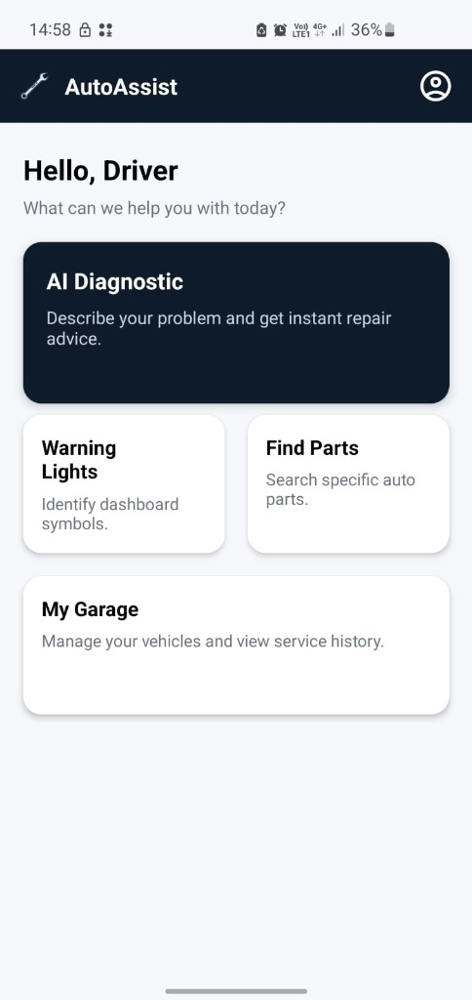
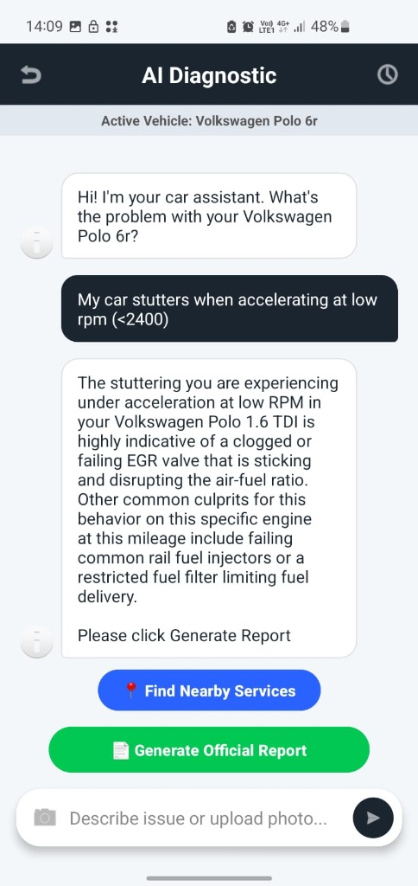
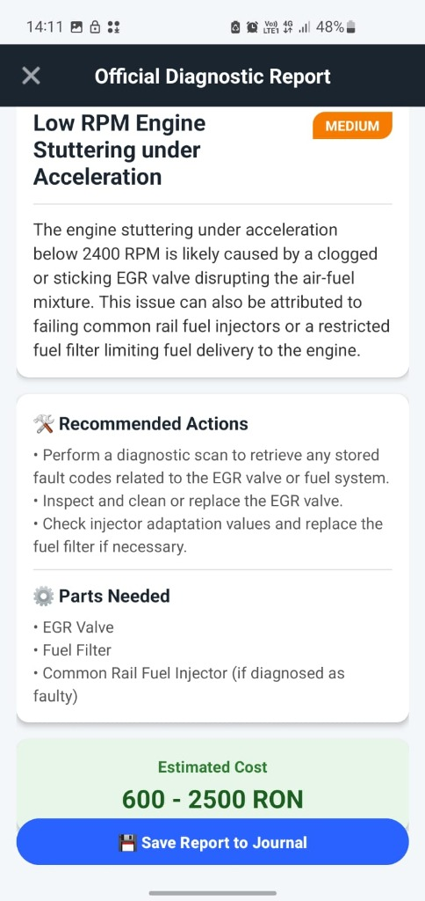
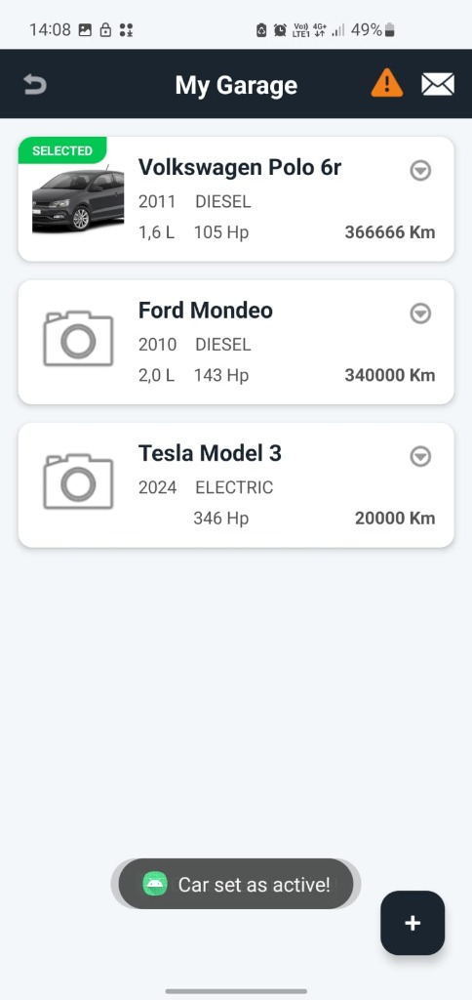
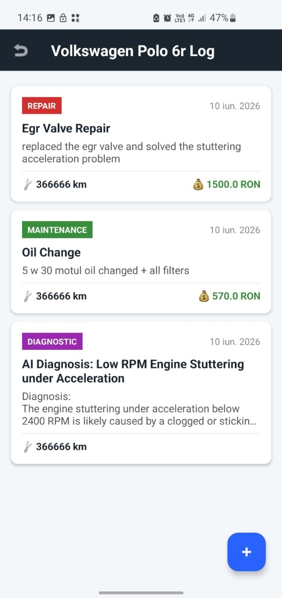

# AutoAssist — Portable Automobile Diagnosis System (`Licenta_Portable_Automobile_Diagnosis`)


**AutoAssist** is an intelligent, cloud-connected Android application developed as a Bachelor's Thesis project that empowers vehicle owners to diagnose automotive malfunctions through Retrieval-Augmented Generation (RAG) and multimodal Large Language Model (LLM) analysis. By combining a curated Firebase Firestore knowledge base of automotive components, dashboard warning lights, and vehicle-specific service history with Google's Gemini AI, the system delivers context-aware, bilingual (English/Romanian) troubleshooting and structured diagnostic reports.

---

## Architecture Overview

AutoAssist implements a client-side **Retrieval-Augmented Generation (RAG)** and **Two-Stage LLM Diagnostic Pipeline** in `AIDiagnosticActivity.java`, grounding the generative model in deterministic vehicle data and curated automotive failure modes before synthesizing an official report in `DiagnosticReportActivity.java`.

```text
+-----------------------------------------------------------------------------------+
|                               USER INPUT LAYER                                    |
|  [Active Car Selection] + [Symptom Text (EN/RO)] + [Optional Photo (<= 1024px)]   |
+-----------------------------------------+-----------------------------------------+
                                          |
                                          v
+-----------------------------------------------------------------------------------+
|                PARALLEL FIRESTORE QUERIES (Tasks.whenAllSuccess)                  |
|                                                                                   |
|  +-----------------------+  +-----------------------+  +-----------------------+  |
|  |      Car_Parts        |  |    Warning_Lights     |  | Vehicles/{id}/Journal |  |
|  | .whereArrayContains(  |  | .get()                |  | .orderBy("timestamp", |  |
|  |  "compatibleFuels",   |  |                       |  |   DESCENDING).get()   |  |
|  |   carFuelLower)       |  |                       |  |                       |  |
|  +-----------+-----------+  +-----------+-----------+  +-----------+-----------+  |
+--------------|--------------------------|--------------------------|--------------+
               +--------------------------+--------------------------+
                                          |
                                          v
+-----------------------------------------------------------------------------------+
|                        CONTEXT AGGREGATION & SYSTEM PROMPT                        |
|  1. Vehicle Specs: Make, Model, Year, Engine (L), Fuel Type, Mileage (km)         |
|  2. Service History: Chronological Journal logs (DIAGNOSTIC, REPAIR, MAINTENANCE) |
|  3. Local DB Grounding: Fuel-filtered CarPart symptoms + WarningLight causes      |
|  4. Behavioral Rules: Confidence threshold (80%), EN/RO matching, Trigger phrase  |
+-----------------------------------------+-----------------------------------------+
                                          |
                                          v
+-----------------------------------------------------------------------------------+
|                     STAGE 1: MULTIMODAL LLM CHAT SESSION                          |
|  Google AI SDK (GenerativeModelFutures / ChatFutures - "gemini-3.5-flash")        |
|  - Low Confidence (<80%): Asks 1-2 targeted clarifying questions                  |
|  - High Confidence (>=80%): Outputs executive summary + Trigger Phrase            |
|    ("Please click Generate Report" / "Te rog apasă pe Generează Raport")          |
+-----------------------------------------+-----------------------------------------+
                                          |
                                          v
+-----------------------------------------------------------------------------------+
|                 STAGE 2: STRUCTURED JSON REPORT GENERATION                        |
|  Dedicated "gemini-3.5-flash" instance processes full ChatMessage transcript      |
|  Enforces strict JSON schema: title, severity, diagnosis, recommended_actions,    |
|  estimated_cost (RON), parts_needed                                               |
+-----------------------------------------+-----------------------------------------+
                                          |
                                          v
+-----------------------------------------------------------------------------------+
|                     UI DIAGNOSTIC REPORT & DUAL PERSISTENCE                       |
|  DiagnosticReportActivity parses JSON, applies severity color-coding, and saves:  |
|  - Global Vehicle Log: Vehicles/{carId}/Journal                                   |
|  - User History:       Users/{uid}/DiagnosticHistory                              |
+-----------------------------------------------------------------------------------+
```

### Diagnostic Execution Pipeline

1. **User Input & Active Vehicle Resolution**: When `AIDiagnosticActivity` launches, `fetchActiveCar()` reads `activeCarId` from `Users/{uid}` and retrieves the corresponding `Car` document from `Vehicles/{activeCarId}`. The user enters natural-language symptoms (in English or Romanian) into `etAiSearchPrompt` and optionally attaches a photo via `ActivityResultContracts.GetContent()`, which is downscaled on-device to a maximum dimension of `1024px` (`scaleBitmapDown()`).
2. **Parallel Firestore Queries (`Tasks.whenAllSuccess`)**: Upon the first prompt submission in a session, `searchDatabaseAndDiagnose()` dispatches three asynchronous Firestore queries concurrently and awaits their combined completion using `Tasks.whenAllSuccess(carPartsTask, warningLightsTask, journalTask)`:
   - **`carPartsTask`**: Queries `Car_Parts` filtered by `.whereArrayContains("compatibleFuels", carFuelLower)` so that only components valid for the active vehicle's propulsion system (`diesel`, `petrol`/`gasoline`, `hybrid`, `electric`) are loaded.
   - **`warningLightsTask`**: Fetches all dashboard indicators, causes, and symptom mappings from `Warning_Lights`.
   - **`journalTask`**: Fetches the vehicle's maintenance and repair timeline from `Vehicles/{carId}/Journal` ordered by `timestamp` descending.
3. **Context Aggregation**: The results from all three snapshots are serialized via `StringBuilder` into `databaseContext` and `journalContext` and injected alongside the `Car` metadata (`carName`, `year`, `engine`, `fuel`, `km`) into the model's `systemInstruction` (`Content`).
4. **LLM API Invocation (`GenerativeModelFutures` & `ChatFutures`)**:
   - **Multi-Turn Conversation**: A `GenerativeModel` (`gemini-3.5-flash`) is initialized with `BuildConfig.GEMINI_API_KEY`, a non-null `RequestOptions()`, and the aggregated system instruction. `ChatFutures` manages multi-turn state off the main thread using `Executors.newSingleThreadExecutor()` and Guava's `Futures.addCallback()`.
   - **Confidence Gating & Trigger Detection**: Following the system prompt rules, the AI asks clarifying questions until it reaches $\ge 80\%$ confidence, at which point it appends a language-specific trigger phrase (`"Please click Generate Report"` or `"Te rog apasă pe Generează Raport"`). The client intercepts this phrase and reveals `btnGenerateReport`.
   - **Structured JSON Synthesis**: Clicking `btnGenerateReport` invokes `generateFinalReportJson()`, which serializes the full `User`/`Mechanic` transcript and prompts a dedicated `gemini-3.5-flash` instance to output a raw JSON object with constant English keys and language-matched values.
5. **UI Diagnostic Report & Persistence**: `DiagnosticReportActivity` sanitizes and parses the JSON payload via `org.json.JSONObject`, dynamically tints `tvSeverityBadge` based on fault criticality (`LOW` $\rightarrow$ `#388E3C`, `MEDIUM` $\rightarrow$ `#F57C00`, `HIGH`/`CRITICAL` $\rightarrow$ `#D32F2F`), and—upon clicking `btnSaveReport`—persists both a `JournalEntry` under `Vehicles/{carId}/Journal` and a `DiagnosticReport` (including `rawJson` and `chatHistory`) under `Users/{uid}/DiagnosticHistory`.

---

## Tech Stack

| Layer | Technology / Library | Version / Details |
| :--- | :--- | :--- |
| **Language & Runtime** | Java | Java 11 (`sourceCompatibility` & `targetCompatibility = JavaVersion.VERSION_11`) |
| **Build System** | Gradle (Kotlin DSL) & Android Gradle Plugin | AGP `8.13.2`, Gradle Version Catalog (`gradle/libs.versions.toml`) |
| **Android SDK** | AndroidX / Jetpack | `minSdk = 31` (Android 12), `targetSdk = 36`, `compileSdk = 36` |
| **UI Framework** | AndroidX AppCompat, Material Design 3, ConstraintLayout | `appcompat:1.7.1`, `material:1.13.0`, `constraintlayout:2.2.1`, `activity:1.12.1` |
| **Authentication** | Firebase Authentication | `com.google.firebase:firebase-auth:24.0.1` (Email & Password, Re-authentication) |
| **NoSQL Database** | Cloud Firestore | `com.google.firebase:firebase-firestore:26.1.0` |
| **Cloud Storage** | Firebase Cloud Storage & FirebaseUI Storage | `com.google.firebase:firebase-storage:22.0.1`, `firebase-ui-storage:9.1.1` |
| **AI / LLM Integration** | Google AI Client SDK for Android (Gemini) | `com.google.ai.client.generativeai:generativeai:0.9.0` (`gemini-3.5-flash`) |
| **Concurrency & Async** | Google Guava (`ListenableFuture`), Play Services Tasks, Kotlin Coroutines | `com.google.guava:guava:33.1.0-android`, `kotlinx-coroutines-android:1.10.2` |
| **Background Scheduling** | AndroidX WorkManager | `androidx.work:work-runtime:2.11.2` (`PeriodicWorkRequest` via `ReminderWorker`) |
| **Image Loading** | Glide | `com.github.bumptech.glide:glide:5.0.5` |
| **Data Parsing & Serialization** | OpenCSV, Gson, `org.json` | `com.opencsv:opencsv:5.12.0`, `com.google.code.gson:gson:2.13.2` |

---

## Database Structure

AutoAssist uses **Cloud Firestore** in a hybrid root-collection and subcollection model designed for low-latency RAG retrieval, multi-user vehicle sharing, and denormalized symptom lookup.

### 1. `Car_Parts` Collection (`CarPart.java`)
Stores automotive components indexed by `category` and `compatibleFuels` for single-query filtering during diagnostic context building. Below is the document schema illustrating both the runtime Firestore fields (`malfunctionSymptoms`, `compatibleFuels`, `urlImage`) and the bilingual (EN/RO) denormalized symptom design:

```json
{
  "id": "egr_valve_01",
  "name": "EGR Valve",
  "category": "Exhaust gas recirculation",
  "compatibleFuels": [
    "gasoline",
    "diesel",
    "hybrid"
  ],
  "malfunctionSymptoms": [
    "Rough idle",
    "Black exhaust smoke",
    "Engine knocking",
    "Check Engine Light illuminated",
    "Loss of power upon acceleration"
  ],
  "symptoms_en": [
    "Rough idle",
    "Black exhaust smoke",
    "Loss of power upon acceleration"
  ],
  "symptoms_ro": [
    "Ralanti instabil",
    "Fum negru pe evacuare",
    "Pierdere de putere la accelerare"
  ],
  "urlImage": "egr_valve.jpg"
}
```

### 2. `Warning_Lights` Collection (`WarningLight.java`)
Seeded from `assets/warning_lights_with_symptoms.csv` via `HomePageActivity.uploadWarningLightsToFirebase()`, storing dashboard symbols alongside denormalized `causes` and observable `symptoms`:

```json
{
  "id": "Engine Temperature Warning Light",
  "name": "Engine Temperature Warning Light",
  "causes": [
    "Engine temperature has exceeded normal limits",
    "Low coolant level",
    "Fan malfunction",
    "Faulty radiator cap",
    "Coolant leaks"
  ],
  "otherDetails": "This light indicates the engine temperature has exceeded normal limits. Drivers should check the coolant level, fan operation, radiator cap, and for coolant leaks.",
  "symptoms": [
    "steam from hood",
    "engine running hot",
    "coolant leak",
    "sweet smell",
    "temperature gauge high",
    "engine smoking"
  ],
  "symptoms_en": [
    "steam from hood",
    "engine running hot",
    "coolant leak"
  ],
  "symptoms_ro": [
    "abur de sub capotă",
    "supraîncălzire motor",
    "scurgeri de antigel"
  ],
  "urlImage": "GOFAR_car-dashboard-symbols-engine-temperature-warning-light.jpg"
}
```

### 3. `Vehicles` Collection (`Car.java`) & `Journal` Subcollection (`JournalEntry.java`)
Vehicles are stored in a top-level `Vehicles` collection rather than nested under a single user, enabling seamless multi-user access (`sharedWith` array) and ownership transfers (`ownerId`).

```json
{
  "id": "v9Xk2LmP8qR4tY1nZ0wA",
  "ownerId": "u7Bp3KcM9xQ2vL5nJ8wE",
  "sharedWith": [
    "u2Mn8VbC4zX1lK9pQ3rT"
  ],
  "carName": "Volkswagen Polo 6r",
  "year": 2011,
  "km": 366666,
  "fuel": "DIESEL",
  "engine": 1.6,
  "power": 105,
  "imgPath": "https://firebasestorage.googleapis.com/v0/b/.../car_images%2F1727596000.jpg",
  "itpExpiration": 1767139200000,
  "rcaExpiration": 1759190400000,
  "rovinietaExpiration": 1772323200000,
  "oilChangeDate": 1756598400000
}
```

Each vehicle document contains a `Vehicles/{carId}/Journal` subcollection:

```json
{
  "id": "j4Kp9LmN2vX8qR1tY5wZ",
  "type": "DIAGNOSTIC",
  "title": "AI Diagnosis: Low RPM Engine Stuttering under Acceleration",
  "description": "Diagnosis:\nThe engine stuttering under acceleration below 2400 RPM is likely caused by a clogged or sticking EGR valve...\n\nActions:\n• Perform a diagnostic scan to retrieve any stored fault codes\n• Inspect and clean or replace the EGR valve\n\nParts:\n• EGR Valve\n• Fuel Filter",
  "mileageAtLog": 366666,
  "cost": 0.0,
  "timestamp": 1781092800000
}
```

### 4. `Users` Collection (`User.java`), `DiagnosticHistory` Subcollection (`DiagnosticReport.java`), `Invites`, & `Global_Stats`
- **`Users/{uid}`**: Stores `uid`, `username`, `email`, `createdAt`, and `activeCarId`.
- **`Users/{uid}/DiagnosticHistory/{reportId}`**: Stores user-specific diagnostic reports including `carName`, `userSymptoms`, `aiDiagnosis`, `timestamp`, `chatHistory`, `rawJson` (used to re-render `DiagnosticReportActivity` in history mode), and `feedbackStatus` (`-1`, `0`, `1`).
- **`Invites/{inviteId}`** (`CarInvite.java`): Stores pending sharing and ownership transfer requests (`carId`, `carName`, `senderEmail`, `targetUid`, `inviteType` $\in$ `["share", "transfer"]`, `timestamp`).
- **`Global_Stats/DiagnosticAccuracy`**: Aggregates global AI diagnostic accuracy ratings (`totalThumbsUp`, `totalThumbsDown`) updated atomically via Firestore `WriteBatch` and `FieldValue.increment(1)`.

---

## Key Features

- **RAG-Grounded Multimodal AI Diagnostics (`AIDiagnosticActivity`)**: Combines active vehicle specifications, fuel-compatible car parts, dashboard warning light definitions, and chronological service logs with optional user-uploaded photos (automatically scaled to `1024px`) to power multi-turn troubleshooting with `gemini-3.5-flash`.
- **Parallel Asynchronous Firestore Queries (`Tasks.whenAllSuccess`)**: Eliminates sequential network bottlenecks by executing `Car_Parts`, `Warning_Lights`, and `Vehicles/{carId}/Journal` queries concurrently before initializing the generative chat session.
- **Bilingual Support & Strict Language Matching (EN/RO)**: Supports English and Romanian workflows (`ProfileActivity` language preference selector and dynamic LLM language detection). The AI assistant automatically converses and generates JSON diagnostic report values in the exact language used by the driver while keeping JSON schema keys standardized and estimating repair costs in `RON`.
- **Structured Diagnostic Output & Severity Grading (`DiagnosticReportActivity`)**: Converts free-form diagnostic conversations into a validated JSON schema containing `title`, `severity` (`LOW`, `MEDIUM`, `HIGH`, `CRITICAL` with dynamic badge color-coding), `diagnosis`, `recommended_actions`, `parts_needed`, and `estimated_cost`, plus one-tap Google Maps navigation to nearby repair shops (`geo:0,0?q=auto+service+near+me`).
- **Interactive Symptom & Component Catalogs (`CarPartsActivity`, `PartsListActivity`, `WarningLightsActivity`)**: Browse 38 component categories parsed via `OpenCSV` from `assets/car_categories.csv`, filter parts and dashboard warning lights in real time via `Filterable` RecyclerView adapters, load cloud-hosted component imagery via `Glide` and `FirebaseStorage`, and launch instant Google Search lookups (`Intent.ACTION_VIEW`).
- **Collaborative Garage & Service Journal (`MyGarageActivity`, `CarJournalActivity`, `InvitesActivity`)**: Manage multiple vehicles (including electric vehicle UI adaptations that hide combustion engine displacement), log `MAINTENANCE`, `REPAIR`, `DOCUMENT`, and `DIAGNOSTIC` entries with automatic odometer synchronization, and share access or transfer vehicle ownership to other registered users via email invitations.
- **Proactive Maintenance & Document Expiration Alerts (`ReminderWorker`)**: Runs a daily background `PeriodicWorkRequest` via AndroidX `WorkManager` alongside in-app 12-hour throttled HTML alert dialogs to notify drivers of upcoming or expired **ITP** (Periodic Technical Inspection), **RCA** (Insurance), **Rovinieta** (Road Tax), and **Oil Change** dates.

---

## Screenshots / UI Walkthrough

### 1. Dashboard & Navigation Hub (`HomePageActivity` & `LoginActivity`)
After authenticating via `LoginActivity` (or registering in `RegisterActivity`), the user lands on `HomePageActivity`. This screen initializes the daily `ReminderWorker` notification job and provides quick-access cards to **AI Diagnostic**, **Warning Lights**, **Find Parts**, **My Garage**, and **My Profile** (`ProfileActivity`).



### 2. Multimodal AI Diagnostic Chat (`AIDiagnosticActivity`)
Displays the currently selected vehicle (`Active Vehicle: Volkswagen Polo 6r`) in `tvActiveCarBanner` and presents a conversational interface (`ChatAdapter` with distinct user and AI message bubbles). Users can attach photos of engine bays or dashboard symbols (`btnAttachPhoto`), answer the AI mechanic's clarifying questions, locate nearby repair shops (`btnFindService`), and click **Generate Official Report** (`btnGenerateReport`) once the diagnosis reaches high confidence.



### 3. Official Diagnostic Report & History (`DiagnosticReportActivity` & `DiagnosticHistoryActivity`)
Renders the structured JSON output from Gemini into Material cards displaying the issue title (`Low RPM Engine Stuttering under Acceleration`), color-coded severity badge (`MEDIUM`), technical explanation, bulleted recommended actions, required replacement parts, and estimated cost in `RON` (`600 - 2500 RON`). Saved reports can be reviewed at any time in `DiagnosticHistoryActivity` and rated with thumbs-up/thumbs-down feedback.



### 4. My Garage & Service Journal (`MyGarageActivity` & `CarJournalActivity`)
`MyGarageActivity` lists all owned and shared vehicles (automatically hiding combustion engine displacement for `ELECTRIC` vehicles like the Tesla Model 3), highlights the active vehicle with a `SELECTED` badge, displays pending invite indicators (`badgeInvites`), and surfaces 30-day expiration alerts for ITP, RCA, Rovinieta, and Oil Changes. From the vehicle options menu (`menu_car_options.xml`), users can open `CarJournalActivity` to inspect or add chronological `REPAIR`, `MAINTENANCE`, `DOCUMENT`, and `DIAGNOSTIC` logs.

| My Garage (`MyGarageActivity`) | Vehicle Log (`CarJournalActivity`) |
| :---: | :---: |
|  |  |

---

## Setup & Installation

Follow these steps to configure and run the project locally in Android Studio:

### Prerequisites
- **Android Studio** Ladybug (or newer) with **JDK 11+**.
- **Android SDK 36** (compile/target SDK) and a physical device or emulator running **Android 12 (API 31)** or higher.
- A **Firebase Project** with Authentication, Cloud Firestore, and Cloud Storage enabled.
- A **Google AI Studio API Key** for the Gemini API.

### 1. Clone the Repository
```bash
git clone https://github.com/AndreiGuineaV/Licenta_Portable_Automobile_Diagnosis.git
cd Licenta_Portable_Automobile_Diagnosis
```

### 2. Configure Firebase (`google-services.json`)
1. Go to the [Firebase Console](https://console.firebase.google.com/) and create or select your Firebase project.
2. Register an Android app with the package name `com.example.licenta_test`.
3. Enable **Authentication** (Email/Password provider), **Cloud Firestore**, and **Cloud Storage** (containing `car_parts/`, `warning_lights/`, and `car_images/` buckets).
4. Download the generated `google-services.json` file and place it in the `app/` module directory:
   ```text
   Licenta_Portable_Automobile_Diagnosis/
   └── app/
       └── google-services.json
   ```

### 3. Configure the Gemini API Key (`local.properties`)
The app reads `GEMINI_API_KEY` from `local.properties` at build time (`app/build.gradle.kts`) and exposes it via `BuildConfig.GEMINI_API_KEY`.
1. Open (or create) the `local.properties` file in the root directory of the project.
2. Add your Android SDK path and your Gemini API key:
   ```properties
   sdk.dir=C\:\\Users\\<YourUsername>\\AppData\\Local\\Android\\Sdk
   GEMINI_API_KEY=your_actual_gemini_api_key_here
   ```

### 4. Build and Run
1. Open the project in **Android Studio** and allow Gradle to sync dependencies (`gradle/libs.versions.toml`).
2. (Optional) To seed the `Warning_Lights` collection from `app/src/main/assets/warning_lights_with_symptoms.csv` on first launch, uncomment `uploadWarningLightsToFirebase(this);` in `HomePageActivity.java` (line 71) for one run, and ensure `Global_Stats/DiagnosticAccuracy` exists in Firestore.
3. Select a target device (API 31+) and click **Run 'app'** (`Shift + F10`), or build from the terminal:
   ```bash
   ./gradlew assembleDebug
   ./gradlew installDebug
   ```
